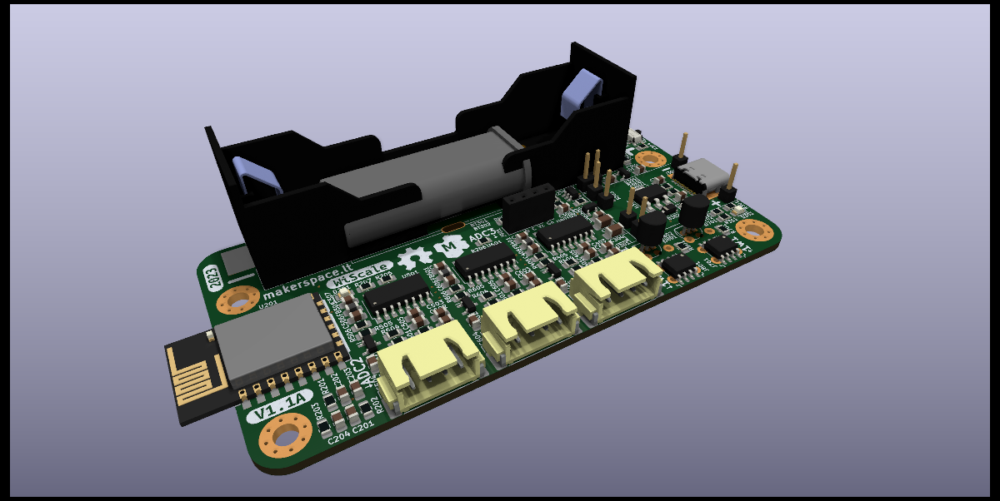
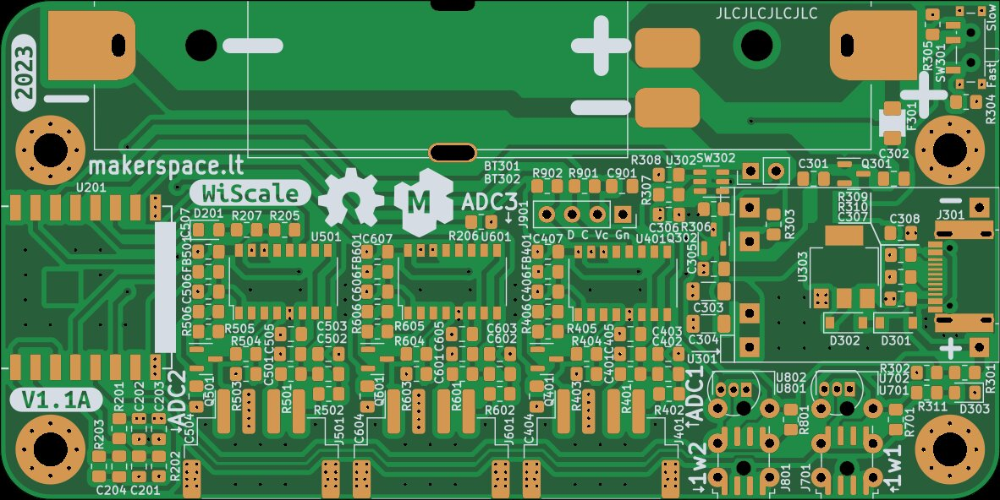
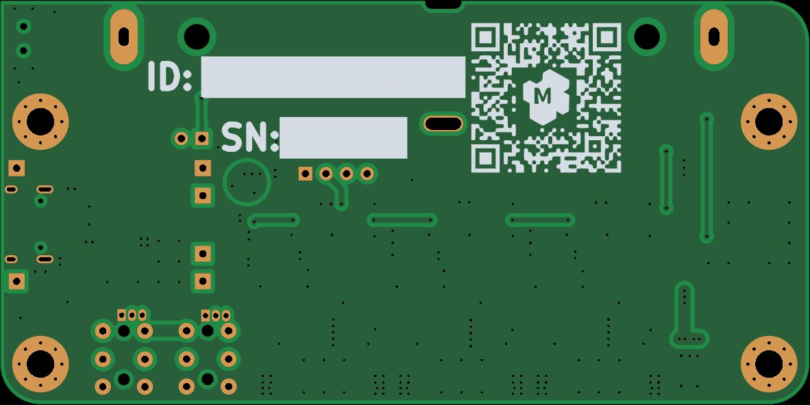
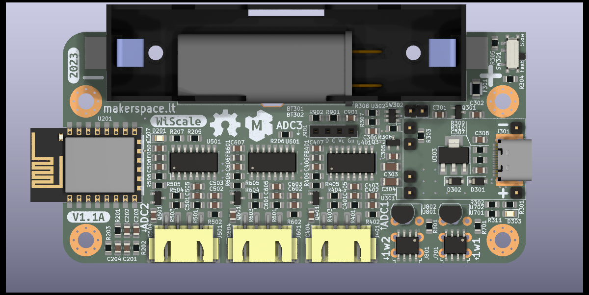

This is ESP8266 (ESP-12F) and HX711 based weight monitoring device.

* Designed to be pretty small.
* Supports multiple load cells.
* Can be populated with 18650 battery
* Can be operated in ultra low power mode

Dev NOTE: before commit, run `./kibot.sh` to regenerate documentation, bom, gerbers and other assets.

* [schematics.pdf](gen/schematics.pdf)
* [pcb.pdf with dimensions](gen/pcb.pdf)
* [ibom.html](gen/bom_ibom.html)
* [gerbers.zip](gen/gerbers/gerbers.zip)

## Normal operation

The circuit should be powered either via a USB connector on the LiPo charger
or battery.

## Assembly and hardware configuration notes

### LiPo charger

Chargers(U301) with protection can be used.

For use without onboard charger R303 must be shorted and U301,R301 and R302
can be omitted. 

### Low-power sleep

A timer is equipped with selectable(SW301) wake-up settings(R304 and R305).

For applications that do not require a low-power sleep, timer can be bypassed
by shorting out R306. Following components can be omitted in assembly:

* U302
* Q302
* SW301,SW302
* R304,R305,R307,R308

### ADC configuration

To reduce noise on measurements capacitors(C401,C402,C403) on ADC input are
placed. As a side effect, they slow down reading settling time after weight
change. Removing these capacitors will give a fast reading but increase spread
by about 3 times.

